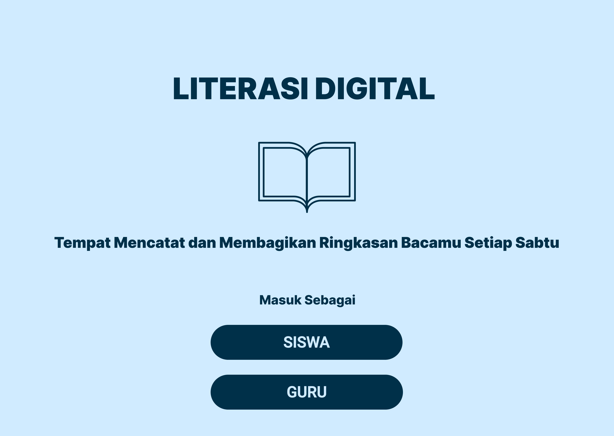
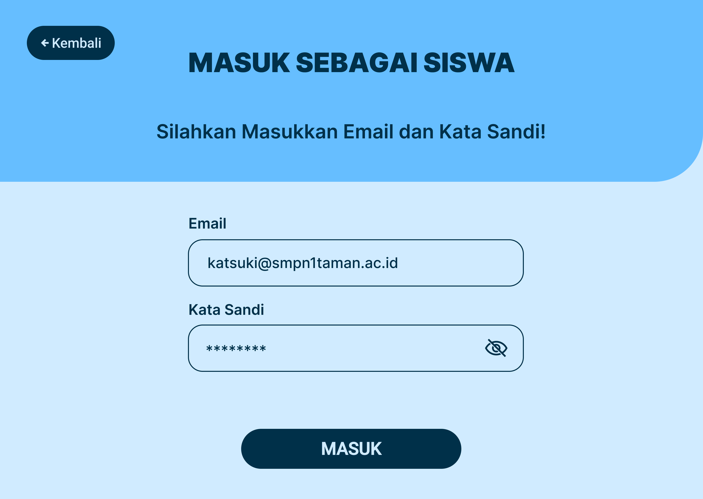
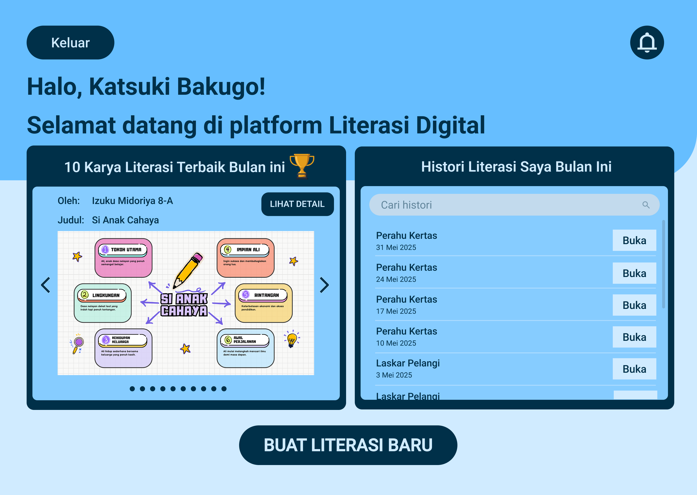
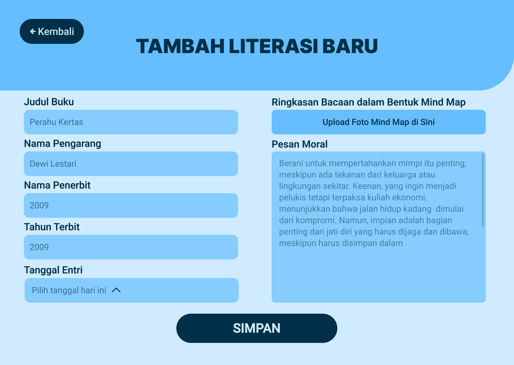

# UI/UX-Literasi-Digital
Case study UI/UX untuk platform literasi digital. Tujuan proyek: membuat pengalaman pengguna lebih intuitif dan interaktif.

## Skill & Tools
- Figma
- Wireframing & Prototyping
- UI/UX Design Principles

## Screenshot / Flow

## Hasil
- Layout responsif
- Flow intuitif
- Case study untuk portofolio

